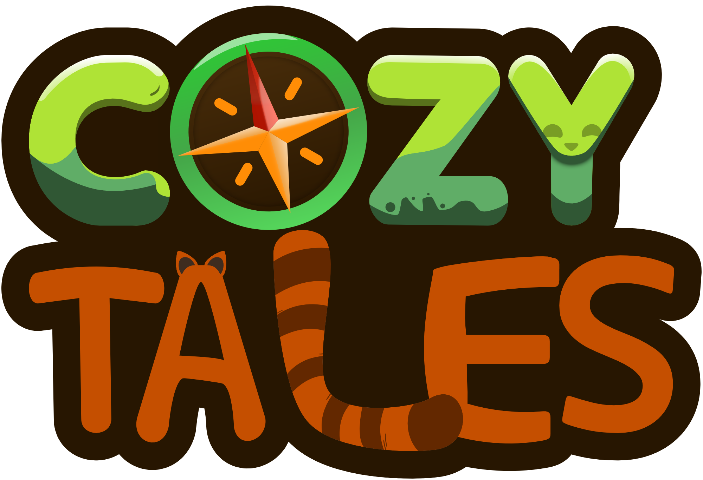

## Cozy Tales (Student Project)
- Itch Page: https://s4g.itch.io/cozytales

#### Open World Exploration

Cozy Tales is an open-world exploration game, intended to be a laid-back
and cozy experience for the player. The player will meet several NPCs on
their journey, which might have interesting information for the player
about where they might find interesting things. The player also has access
to a map, which, initially, is enshrouded by a fog of war. An overarching
event system will dynamically trigger quests, which the player can mark on
their map. If the players puts down a correct map marker, the world will
react to it accordingly.

#### Gameplay
- decelerating gameplay, meant to be played without any stressful game-mechanic
- main focus on exploration and interacting with the world
- paying attention to what NPCs tell you, since the game will not give the player a lead, such as a quest marker

#### Roles
- Gameplay & AI Programmer
- Engineering Lead

#### Engine / Languages
- Unreal Engine 5 / Blueprints, C++

#### Responsibilities
- AI Behaviour (Daily Routine, Wild Life)
  - NPCs can have a daily routine which can easily be edited by the designers via actor components in the NPCs inspector
- Dialogue System
  - Humanoid NPCs can have conversations with each other or the player, giving them important informations about the world
  - Every written line can be fitted with an audio file, mainly serving as an audible voice line
  - Certain dialogues trigger certain events/quests or resolve these
  - Conversations can happen both with and without the direct interaction of the player
- Quest & Event System
  - the activation or resolution to an event results in NPCs reacting in a certain manner
    - new conversations need to be assigned to them while old, redundant conversations need to be deleted from their repertoire
  - after marking their map, the player needs an interface to interact with the Quest System
    - implemented a Quest Board for the player to interact with
- Fishing Mechanic
  - Implemented the progress-bar minigame on top of the base fishing functionality, made by my co-engineer YoSiem
- Trading
  - Implemented NPCs which will trade items for the player's fish
    - Created a Datatable for the designers to easily customize the items being traded to the player
- Performance Optimization
- Animation Blueprints

#### Documentation

Some of the documents I created to show my team how to work with the tools I made.
(These documents are partially deprecated and mostly serve the purpose of showing, how I communicated with my team)

- [Setting up an Event](./Docs/EventSetupFullGuide.pdf)
- [Setting up a daily routine for an NPC](./Docs/DailyRoutineGuide.pdf)
- [Using the Quest Module Asset from the Marketplace to create conversation-flowcharts(DEPRECATED)](./Docs/QuestModuleGuide.pdf)
